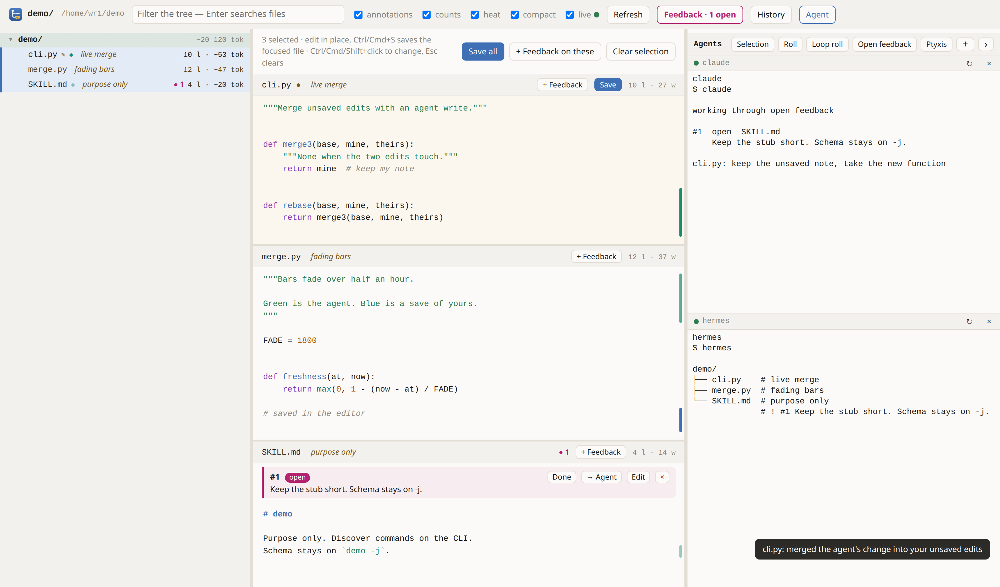

# treedit

[](https://github.com/wr1/treedit/actions/workflows/ci.yml)
[](https://codecov.io/gh/wr1/treedit)
[](https://pypi.org/project/treedit/)
[](https://pypi.org/project/treedit/)
[](LICENSE)
[](https://github.com/astral-sh/ruff)
[](https://github.com/pre-commit/pre-commit)

Editor and annotator aimed at agent assisted editing of skill trees.
Review a directory tree with an agent collaborator: annotate files and folders, leave feedback on
files, lines or the structure, and let the agent answer it from the CLI.
A [treeparse](https://github.com/wr1/treeparse) toolbox with a native (Tauri) window.



## Install

```sh
uv tool install treedit      # or: pipx install treedit (Python 3.12+, Linux/macOS)
make tool                    # from a checkout: the CLI plus the native window (needs Rust; make app-deps)
```

Without the `treedit-app` window, `treedit open` uses your web browser.

## Discover

```sh
treedit -h                   # command tree
treedit -j                   # machine-readable JSON schema
treedit <cmd> -h             # one branch
```

## Development

```sh
make help
```

Releases: bump the version in `pyproject.toml` and `src/treedit/__init__.py`, update `CHANGELOG.md`, then
push a `vX.Y.Z` tag; the release workflow tests, publishes to PyPI and creates the GitHub release.

## License

MIT, see [LICENSE](LICENSE). Bundles [xterm.js](https://github.com/xtermjs/xterm.js) (MIT,
`src/treedit/vendor/LICENSE-xterm.txt`).
