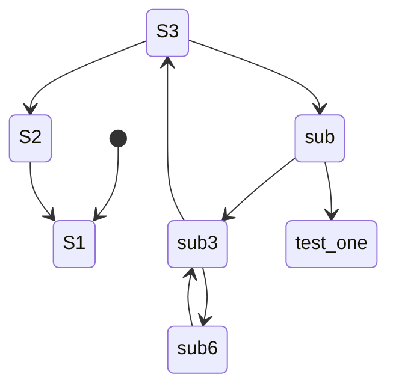

## Graph

```mermaid
stateDiagram-v2
    [*] -->  S1
    S2
    S2 --> S1
    S3 --> S2
    S3 --> sub
    sub --> sub3
    sub3 --> sub6
    sub --> test_one
    sub3 --> S3
    sub6 --> sub3
```

## S1
- one 
## S2

## S3

## sub

## sub3

## sub6

- first item
- second item
  - third
  - fourth

## test_one

- first
